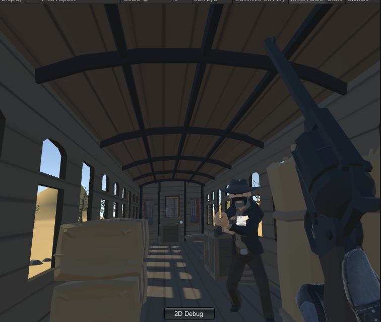

# shooting_game_VR-project
 COSE434 VR game project

 ---

 ## 플레이 방법

 * 프로젝트를 다운로드 한 다음 유니티 에디터로 프로젝트를 연다.
 * Assets/Scenes/Main.unity 씬을 플레이하면 된다.
 * 같은 경로에 Start.unity 씬도 있으나 테스트용 환경이니 본 게임과는 그닥 상관이 없다.

 ## 조작 방법
 

 ### oculus touch controller 기준

 #### 오른쪽 컨트롤러

 * `A` 버튼 : 리볼버 장전 모드
    * 실린더가 왼쪽으로 튀어나옴
    * 장전 모드일 시 플레이어 양쪽에 달려 있는 홀스터가 고정됨
    * 고개를 왼쪽으로 기울여 탄알집에서 탄알을 집어 튀어나온 실린더에 넣으면 한 발씩 장전됨
        * 계속 장전하려면 탄알집에서 한 발씩 계속 집어 넣어야 함
 * `조이스틱` 왼쪽 / 오른쪽 기울이기 : 시점 30-45도씩 각 방향으로 이동
 * `Grap` 버튼 : 총을 잡거나 기타 상호작용 가능한 물체들을 집는 기능
    * 총이나 물체를 계속 잡고 있으려면 버튼을 계속 누르고 있어야 함
 * `Trigger` 버튼 : 총을 잡은 상태에서 총을 발사할 수 있음

#### 왼쪽 컨트롤러

* `조이스틱` 상하좌우 기울이기 : 기울인 방향으로의 이동 가능
    * 멀미 유의
* `X` 버튼 : 텔레포트 모드
    * 텔레포트가 생각보다 정말 안된다. 플레이 시 잘 안 되면 5-15번까지는 같은 데로 연타를 해보거나 조이스틱을 기울여 직접 이동할 것. 원인이 뭔지는 잘 모르겠다.
* `Grap` 버튼 : 총을 잡거나 기타 상호작용 가능한 물체들을 집는 기능
    * 총이나 물체를 계속 잡고 있으려면 버튼을 계속 누르고 있어야 함
    * 왼손은 총을 집는 기능은 없음. 물체는 상호작용 가능

## 게임 완성도

* 열차는 총 5칸
* 맨 끝칸부터 시작하는데 처음에는 기차 밖 말을 타고 있는 상태
    * 텔레포트로 기차 안으로 들어와야 함
* 1-5칸까지 적이나 상호작용 가능한 `문`(문고리를 만지면 열림), 물체 등은 구현 완료
* 기차 머리에 있는 여자 인질까지 가면 원래는 게임이 끝나는데 그 부분은 아직 미구현
* 적이나 플레이어나 모두 총알을 얼마 이상 맞으면 죽는다. 게임 오버 가능

