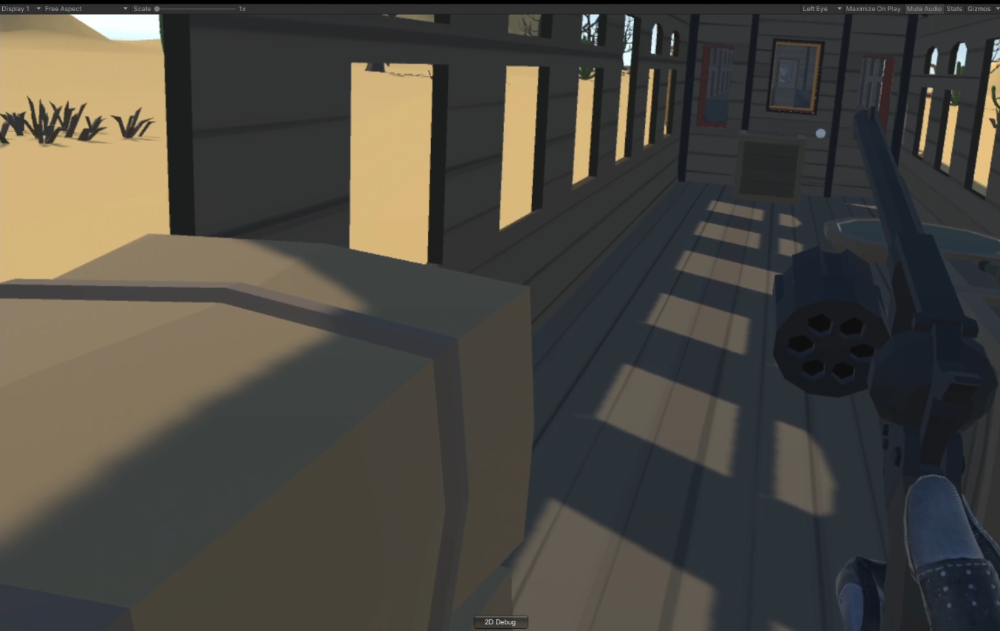
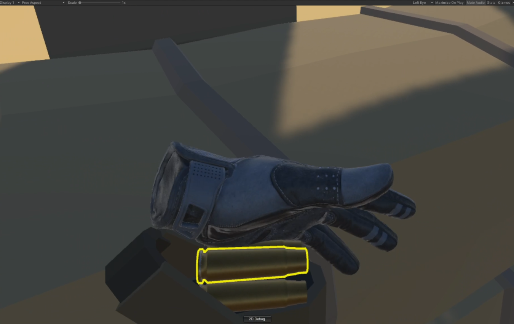
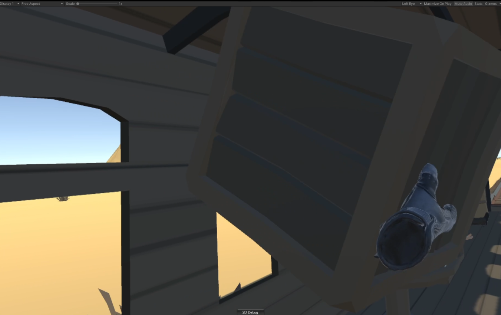
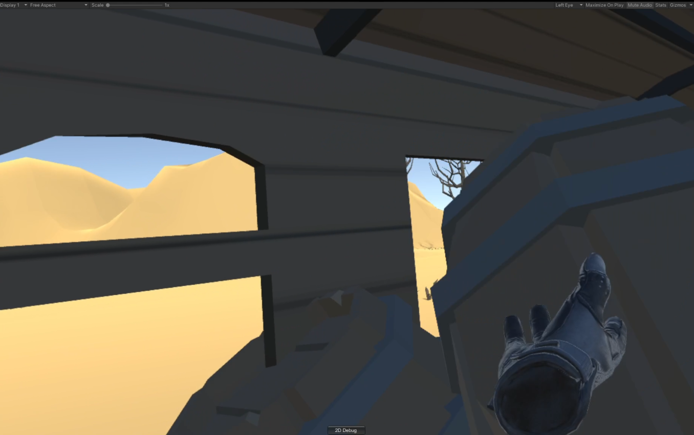
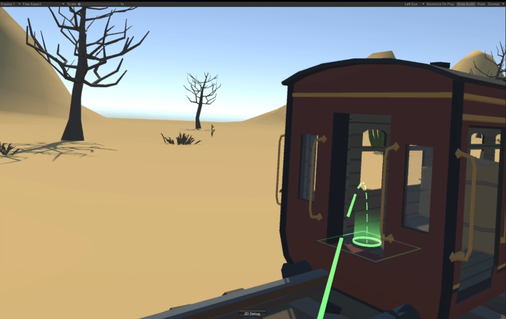
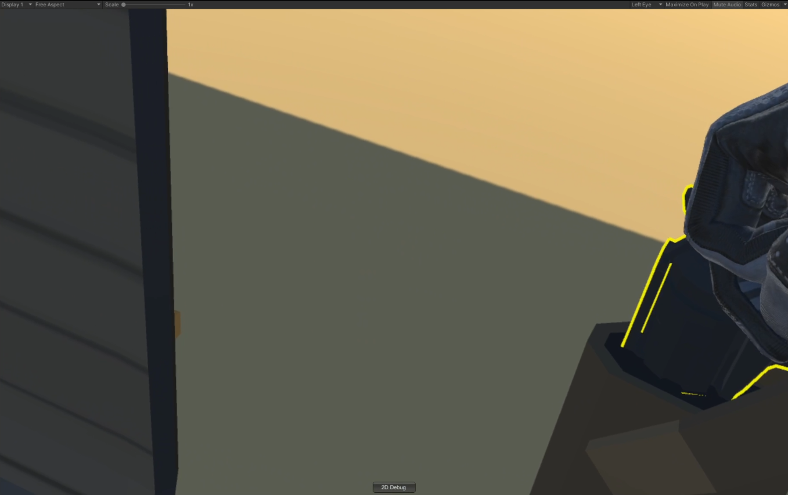
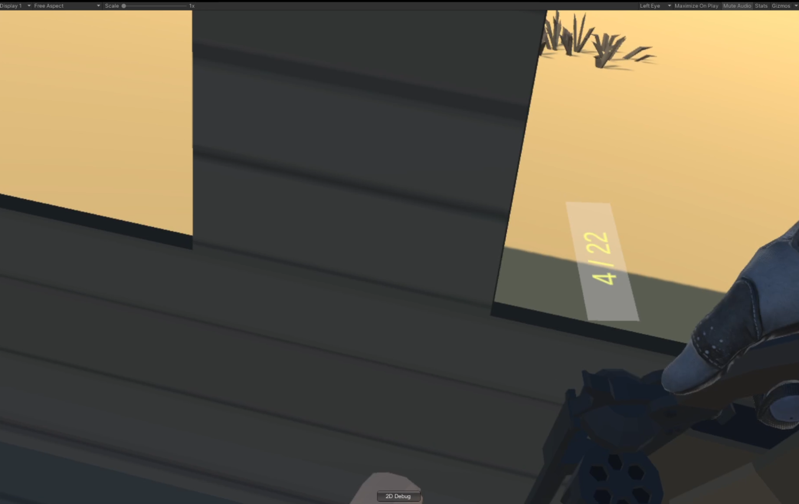
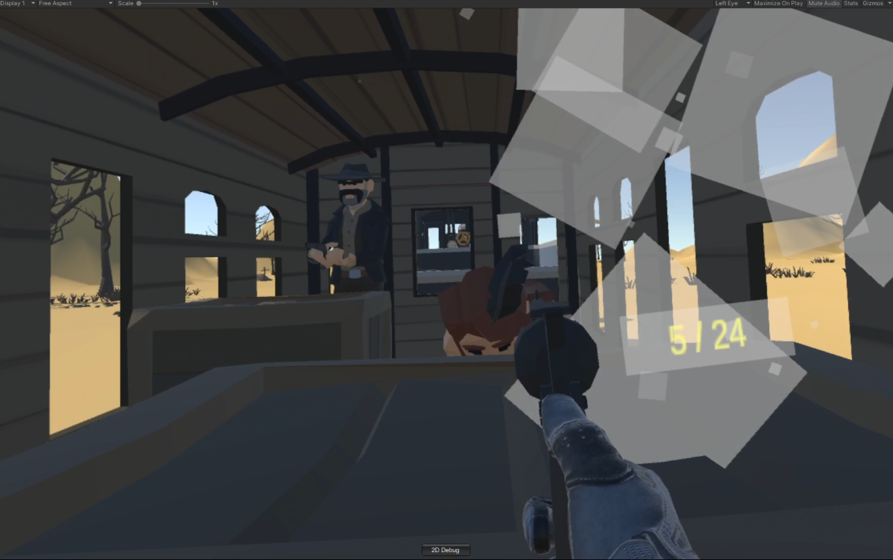
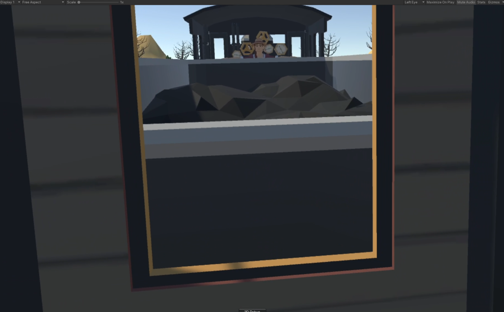
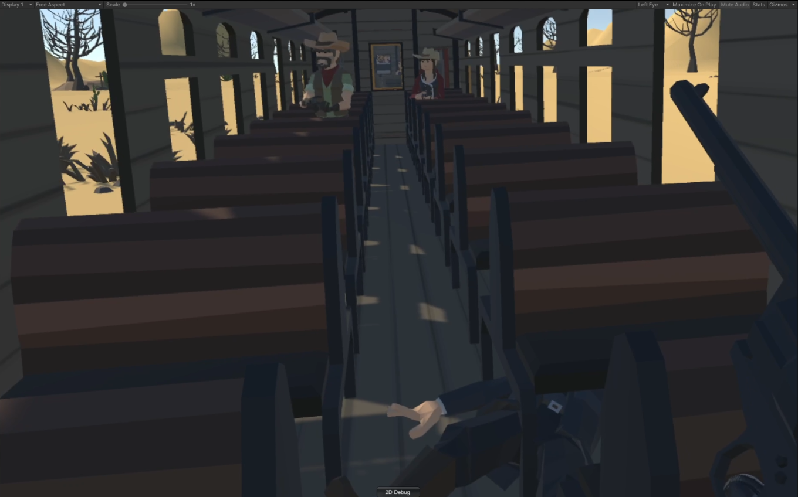

# shooting_game_VR-project
 COSE434 VR game project

 ---

 ## 데모 동영상 링크(유튜브)

 https://youtu.be/pF1Kcx9T2NE

 ## 플레이 방법

 * 프로젝트를 다운로드 한 다음 유니티 에디터로 프로젝트를 연다.
 * Assets/Scenes/Main.unity 씬을 플레이하면 된다.
 * 같은 경로에 Start.unity 씬도 있으나 테스트용 환경이니 본 게임과는 그닥 상관이 없다.

 ## 조작 방법
 

 ### oculus touch controller 기준

 #### 오른쪽 컨트롤러

 * `A` 버튼 : 리볼버 장전 모드 Toggle
    * 장전 모드가 아닐 시, 리볼버의 `실린더`가 왼쪽으로 튀어나옴
    
    * 장전 모드일 시, 리볼버의 `실린더`가 원래대로 수납이 된다.
    * 장전 모드가 아닐 시에는 플레이어의 양쪽 허리춤에 달려 있는 홀스터가 플레이어의 방향에 따라 `rotation` 상태가 변하게 된다.
        * 홀스터의 `position`은 항상 `player`의 `position`을 따라간다.
        * 플레이어가 어디에 위치하든, 항상 양쪽 허리춤에 홀스터가 위치하게 된다.
    * 장전 모드일 시 플레이어 양쪽에 달려 있는 홀스터의 `rotation` 상태가 고정된다.
    * 장전 모드에서 고개를 왼쪽으로 기울여 왼쪽 허리 부근에 위치한 탄알집에서 탄알을 집어, 리볼버의 튀어나온 실린더에 넣으면 한 발씩 장전됨
    
        * 계속 장전하려면 탄알집에서 한 발씩 계속 집어 넣어야 함
 * `조이스틱` 왼쪽 / 오른쪽 기울이기 : 시점 30-45도씩 각 방향으로 이동
 * `Grap` 버튼 : 총을 잡거나 기타 상호작용 가능한 물체들을 집는 기능
    * 컨트롤러 기준 `Trigger` 버튼보다 아래쪽에 위치한 버튼
    * 총이나 물체를 계속 잡고 있으려면 버튼을 계속 누르고 있어야 함
 * `Trigger` 버튼 : 총을 잡은 상태에서 누를 때마다, 총을 발사할 수 있음
    * 컨트롤러 기준 위쪽에 달린 버튼

#### 왼쪽 컨트롤러

* `조이스틱` 상하좌우 기울이기 : 기울인 방향으로의 이동 가능(걷기)
    * 멀미 유의
* `X` 버튼 : 텔레포트 모드
    * 텔레포트가 생각보다 정말 안된다. 플레이 시 잘 안 되면 5-15번까지는 같은 데로 연타를 해보거나 조이스틱을 기울여 직접 이동할 것. 원인이 뭔지는 잘 모르겠다.
* `Grap` 버튼 : 총을 잡거나 기타 상호작용 가능한 물체들을 집는 기능
    * 총이나 물체를 계속 잡고 있으려면 버튼을 계속 누르고 있어야 함
    * 왼손은 총을 집는 기능은 없음. 물체는 상호작용 가능

## 상호작용 주의사항

 * 손으로 집을 수 있는 물체는 계속 `grab`에 해당하는 버튼을 누르고 있어야 계속 들고 있는 상태가 된다
    * 버튼에서 손을 떼면 리볼버의 경우 플레이어의 오른쪽 허리춤에 달린 홀스터로 총이 자동으로 수납된다.
    * 집을 수 있는 상자는 중력의 영향을 받아 그냥 그 자리에서 열차 바닥으로 떨어진다.
    * 문을 막고 있는 상자나 나무통의 경우는, 집는 것은 물론이고 던질 수도 있다.
    
    

## 게임 완성도 & 게임 플레이 방법

* 열차는 총 5칸
* 맨 끝칸부터 시작하는데 처음에는 기차 밖 말을 타고 있는 상태
    * 텔레포트로 기차 안으로 들어와야 함
    
* 처음에는 리볼버가 오른쪽 허리춤 홀스터에 꽂혀 있는 상태
    * 이걸 `A` 버튼을 눌러 장전 모드로 변경하여 홀스터를 고정시킨 다음, 고개를 오른쪽으로 돌려 홀스터에서 리볼버를 뽑아야 한다.
    
* 리볼버를 일단 한번 잡으면, 다시 홀스터에 꽂는 방법은 다시 장전 모드로 변경한 다음 고개를 오른쪽으로 돌려 같은 홀스터에 리볼버를 갖다 대고 `grap` 버튼을 떼면 된다.

* 1-5칸까지 적이나 상호작용 가능한 `문`(문고리를 만지면 열림), 물체 등은 구현 완료

* 기차 머리에 있는 여자 인질까지 가면 원래는 게임이 끝나는데 그 부분은 아직 미구현

* 적이나 플레이어나 모두 총알을 얼마 이상 맞으면 죽는다. 게임 오버 가능

